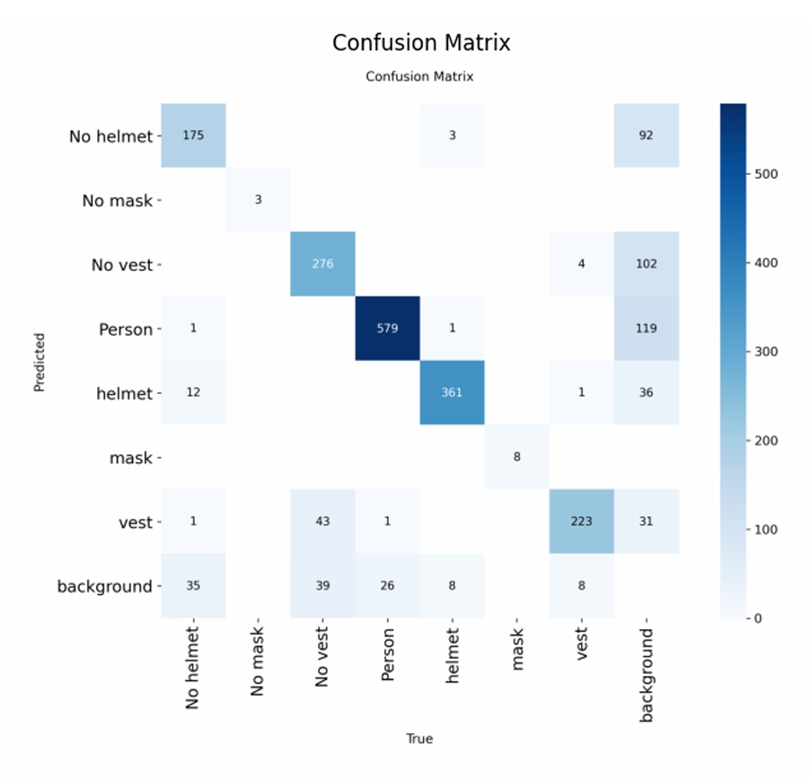
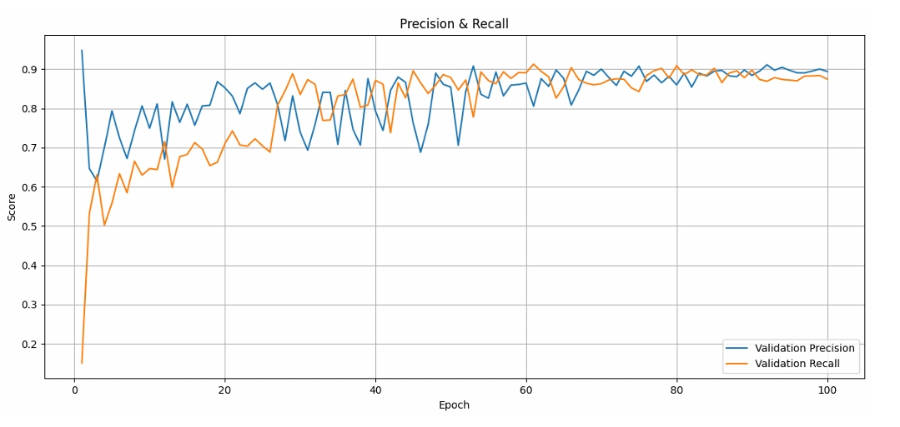
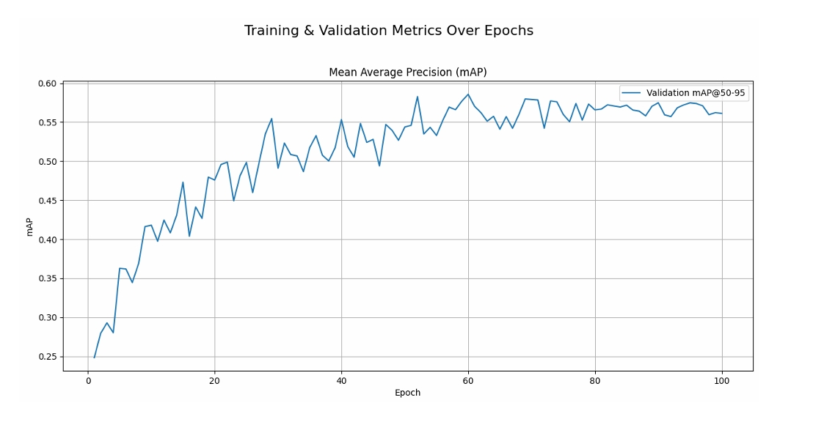
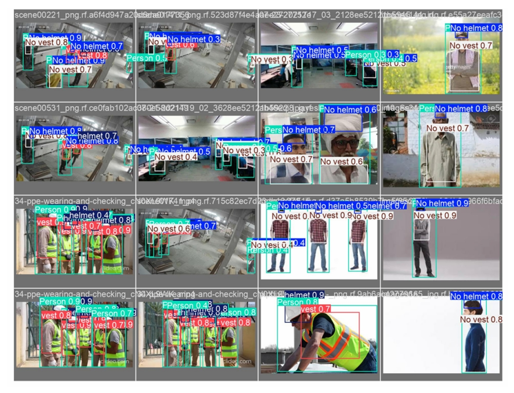

# Automated PPE Compliance Detection using YOLOv5

A deep learning-based computer vision system developed to automatically detect Personal Protective Equipment (PPE) such as helmets and safety vests on workers in industrial environments.

---

## 📌 Overview

Ensuring proper usage of PPE is critical in hazardous work environments such as construction sites and manufacturing plants. Traditional manual supervision methods are inefficient and prone to human error.

This project presents an automated PPE compliance detection system using the YOLOv5 object detection model to identify workers wearing safety helmets and vests from image and video data.

---

## 🧠 Model Details

- Object Detection Model: YOLOv5s  
- Framework: PyTorch  
- Image Processing: OpenCV  
- Numerical Computation: NumPy  
- Dataset: PPE-Detection Dataset  

---

## ⚙️ Working Pipeline

1. Input image or video frame
2. Image preprocessing and normalization
3. Inference using trained YOLO model
4. Detection of PPE items (helmet, vest)
5. Bounding box visualization with confidence scores

---

## 📊 Performance Evaluation

Model performance was evaluated using:

- Confusion Matrix
- Validation Loss
- Precision and Recall
- Mean Average Precision (mAP@0.5)

---

## 📉 Confusion Matrix

---

## 📈 Precision–Recall Curve

---

## 📊 mAP@0.5 Plot

---

## 🖼️ Sample Detection Output

---

## 📄 Project Report
Full documentation available here:  
[PPE_Compliance_Detection_Report.pdf](PPE_Complianc_Detection.pdf)

---

## 📈 Applications

- Construction Site Monitoring  
- Industrial Safety Compliance  
- Manufacturing Plant Supervision  
- Automated Workplace Surveillance
